name: inverse
layout: true
class: center, middle, inverse
---
# クラウドデータベース<br>基礎マスター講座<br><span style="font-size: 50%">for iOS（Swift）</span>
富士通クラウドテクノロジーズ株式会社

.right[]

.footnote[
2018/09/18作成
]

---
layout: true
class: center, middle, inverse_sub
---
# はじめに

---
layout: false

.footnote_right[
はじめに
]

## セミナー概要
__問い合わせフォーム__ をイメージしたサンプルアプリを通して、クラウドデータベースへの保存と検索の方法を学んでいきます

.center[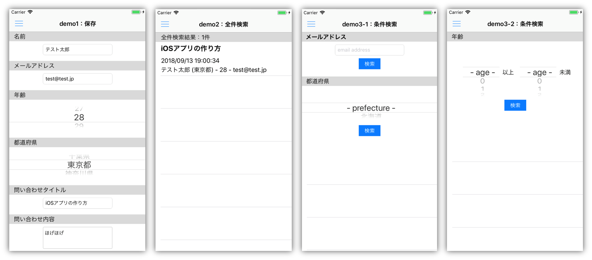]

---
.footnote_right[
はじめに
]

## データをクラウドに保存する<br>３つのメリット

.size_large_13[
1. 保存した瞬間、瞬時にデータを共有できる
1. 機種変更やアプリをアンインストールしても<br>データがなくならない
1. アプリにデータを持たないのでアプリの容量を軽くできる
]

.center[]

---
.footnote_right[
はじめに
]
## 今回習得できる内容
### クラウドデータベースの基本的な使い方
#### データの保存

.center[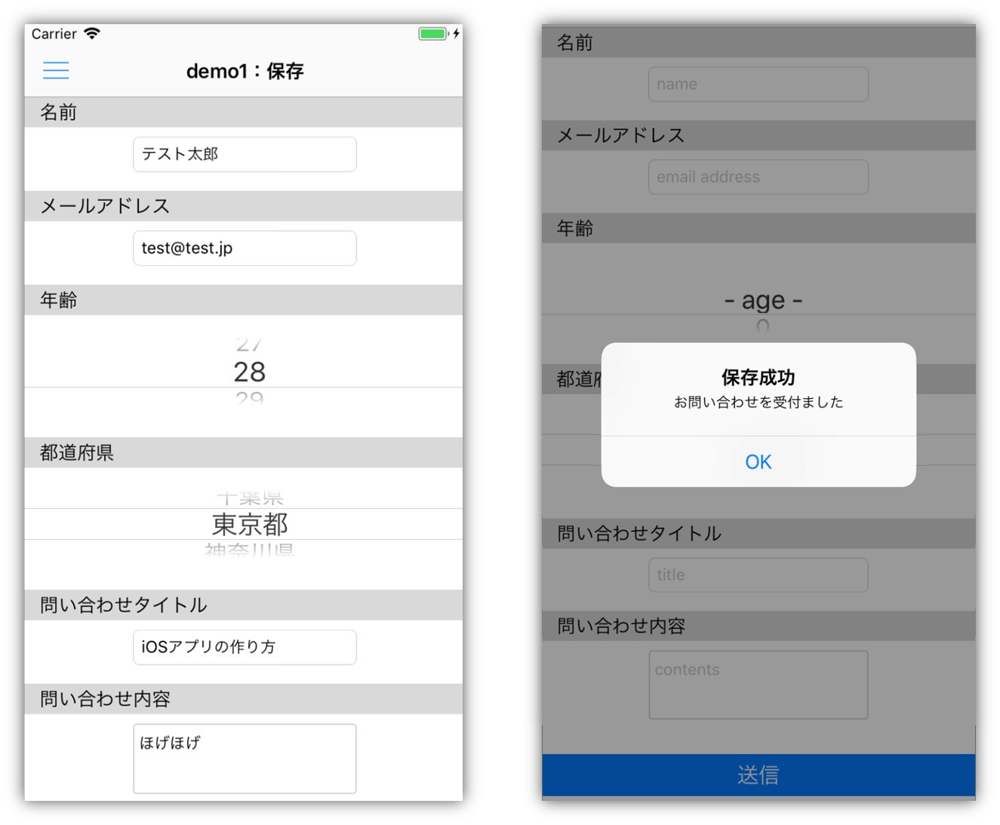]

---
.footnote_right[
はじめに
]
## 今回習得できる内容
### クラウドデータベースの基本的な使い方
#### データの取得

.center[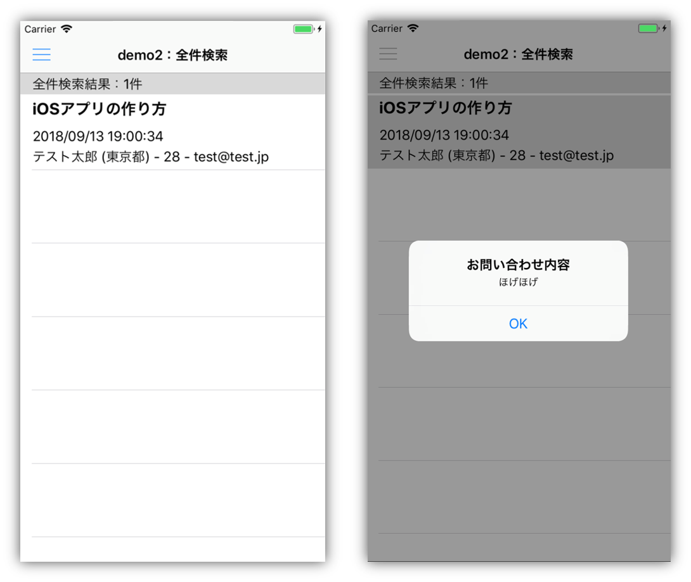]

---
.footnote_right[
はじめに
]
## 今回習得できる内容
### クラウドデータベースの基本的な使い方
#### データの条件検索取得（完全一致検索・範囲指定検索）

.center[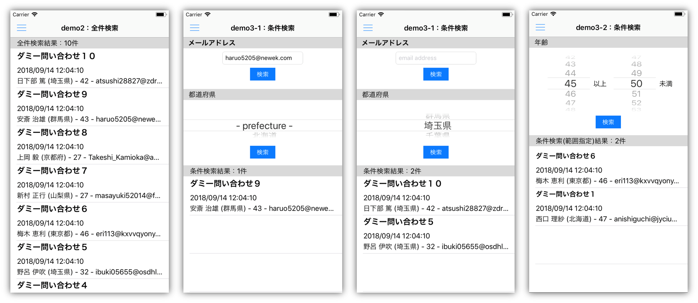]

---
.footnote_right[
はじめに
]
## 今回習得できる内容
### おまけ

* データの削除
* データの更新
* その他 ニフクラ mobile backned でできること

---
.footnote_right[
はじめに
]
## 今回利用するツール
### ニフクラ mobile backend
__にふくら-もばいる-ばっくえんど 【[ニフクラ mobile backend](https://mbaas.nifcloud.com/about.htm)】__ スマートフォンアプリに必要なバックエンド機能が開発不要で利用できるクラウドサービス。 クラウド上に用意された機能を API で呼び出すだけで利用できます。また、APIを簡単に使うための SDK を用意しています（ iOS / Android / Monaca / Unity ）。mobile Backend as a Service の頭文字を取って、通称 **mBaaS** と呼ばれます。

.center[]

---
layout: true
class: center, middle, inverse_sub
---
# ハンズオン

---
layout: false

.footnote_right[
ハンズオン
]

## 事前準備

* Mac と以下の環境を使用します
  * Xcode ver.9 以上推奨
  * ターミナル
* ニフクラ mobile backend の利用登録（無料）
  * https://mbaas.nifcloud.com/signup.htm
  * SNS ID でアカウントを取得してください

---
.footnote_right[
.right[
ハンズオン
]
]

## 取り組み内容
クラウドデータベースとの連携以外の処理をコーディング済みのサンプルプロジェクトを利用します。mobile backend との連携部分のコーディングや設定を行うことで、動作確認いただけます。

### 1. 環境準備

1. mobile backend の準備
  * アプリの新規作成
1. Xcode の準備
  * サンプルプロジェクトの準備
  * mobile backend iOS SDK の導入
  * サンプルプロジェクトを開く
  * mobile backend APIキーの設定と SDKの初期化

.size_small_7[
※この作業は今回のサンプルアプリに関わらず、mobile backend を利用する場合は必ず実施いただく手順です。
]

---
.footnote_right[
.right[
ハンズオン
]
]

### 2. コーディングと動作確認・解説

1. コーディングの進め方について
1. 『demo1：保存』
  * 『demo1：保存』コーディング
  * 『demo1：保存』動作確認
1. 『demo2：全件検索』
  * 『demo2：全件検索』コーディング
  * 『demo2：全件検索』動作確認
1. 『demo3：条件検索』（完全一致/～以上～未満）
  * 『demo3-1：条件検索』（完全一致）コーディング
  * 『demo3-1：条件検索』（完全一致）動作確認
  * 『demo3-2：条件検索』（～以上～未満）コーディング
  * 『demo3-2：条件検索』（～以上～未満）動作確認
1. おまけ
  * データの削除
  * データの更新
  * その他 mobile backend でできること

---
layout: true
class: center, middle, inverse_sub
---
# 1. 環境準備

---
layout: false

.footnote_right[
.right[
ハンズオン<br>1. mobile backend の準備
]
]

## 1. mobile backend の準備
### アプリの新規作成

* mobile backend にログインします

.center[]

https://mbaas.nifcloud.com/

---
.footnote_right[
.right[
ハンズオン<br>1. mobile backend の準備
]
]

### アプリの新規作成
* 新しいアプリを作成します
* アプリ名を入力し「`新規作成`」をクリックします　例）.color_blue[__SwiftFormApp__]

.center[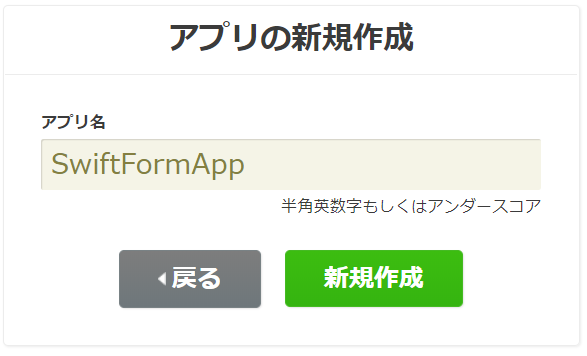]

* mobile backend を既に使用したことがある場合は、画面上方のメニューバーにある「`+新しいアプリ`」をクリックすると同じ画面が表示されます

.center[]

---
.footnote_right[
.right[
ハンズオン<br>1. mobile backend の準備
]
]

### アプリの新規作成
* アプリが作成されるとAPIキー（２種類）が発行されます
 * APIキーは後で使用します。
* ここでは使用しないので、「OK」で閉じます

.center[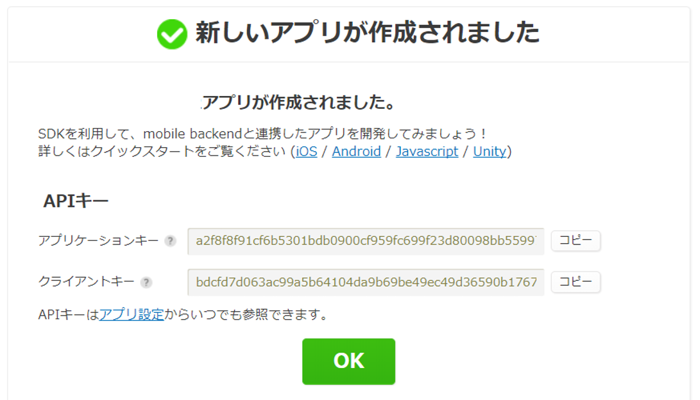]

---
.footnote_right[
.right[
ハンズオン<br>2. mobile backend 準備
]
]

### アプリの新規作成
* 管理画面が開かれ、ダッシュボードが表示されます

.center[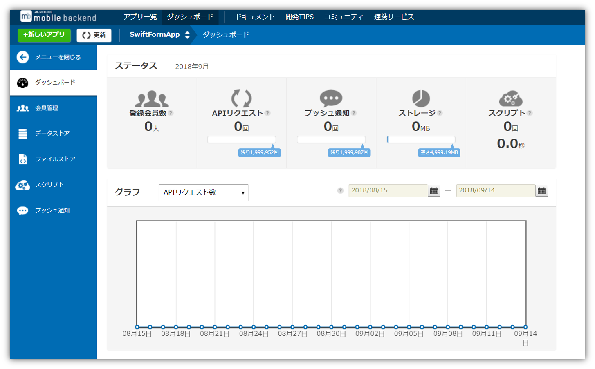]

mobile backend の準備は完了です

---
.footnote_right[
.right[
ハンズオン<br>2. Xcode の準備
]
]

## 2. Xcode の準備
### サンプルプロジェクトの準備

* 下記リンクからプロジェクトをローカルフォルダにダウンロードします

.size_large_15[
.center[
__http://bit.ly/natsumo_SwiftFormApp2__
]
]

* zipファイルを解凍して内容を確認します

.center[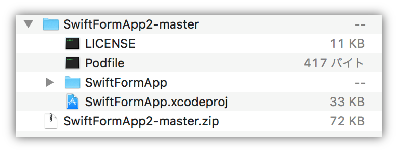]

---
.footnote_right[
.right[
ハンズオン<br>2. Xcode の準備
]
]

### mobile backend iOS SDK の導入

.size_small_7[.color_red[__注意__]<br>
Xcode プロジェクト「SwiftFormApp.xcodeproj」はまだ起動しないでください！]

* mobile backend を使うための iOS SDK を導入していきます
* ターミナルを開きます

.center[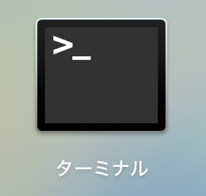]

---
.footnote_right[
.right[
ハンズオン<br>2. Xcode の準備
]
]
### mobile backend iOS SDK の導入
#### CocoaPods をインストールする（初回のみ）

.color_red[.size_small_7[※ 既にインストール済みの場合は本作業は不要です]]

* ターミナルで以下を実行します
  * cocoaPods のインストール
  ```bash
  $ sudo gem install cocoapods
  ```
  * cocoaPods のセットアップ
  ```bash
  $ pod setup
  ```
  * （確認）バージョン情報
  ```bash
  $ pod --version
  ```

---
.footnote_right[
.right[
ハンズオン<br>2. Xcode の準備
]
]

### mobile backend iOS SDK の導入
#### SDK のインストール

* ターミナルで以下を実行します
  * 先ほどダウンロードしたフォルダ内にある Xcode プロジェクト「SwiftFormApp.xcodeproj」と同じディレクトリに移動
  ```bash
  $ cd 'プロジェクトパス'
  ```
<br><br><br>

.size_small_7[
* 通常はここでインストールするライブラリを指定するファイル「Podfile」を作成し編集して利用しますが、今回のサンプルには既に Podfile を準備していますのでそちらを使用します
  * （参考）Podfile 作成 .color_red[.size_small_7[※ ここでは実行不要です]]
  ```bash
  $ pod init
  ```
]

---
.footnote_right[
.right[
ハンズオン<br>2. Xcode の準備
]
]
### mobile backend iOS SDK の導入
#### SDK のインストール

* 先ほどダウンロードしたフォルダ内にある「Podfile」を確認します

```ruby
# Uncomment the next line to define a global platform for your project
platform :ios, '10.0'

target 'SwiftFormApp' do
  # Comment the next line if you're not using Swift and don't want to use dynamic frameworks
  use_frameworks!

  # Pods for SwiftFormApp
  pod 'NCMB', :git => 'https://github.com/NIFCloud-mbaas/ncmb_ios.git'
  pod 'UITextView+Placeholder'
  pod 'ProgressHUD'
  pod 'IQKeyboardManagerSwift'

end
```

---
.footnote_right[
.right[
ハンズオン<br>2. Xcode の準備
]
]
### mobile backend iOS SDK の導入
#### SDK のインストール

* ターミナルで以下を実行します
  * podfileに書いた内容で SDK をインストール
  ```bash
  $ pod install
  ```
  * 基本は上記コマンドでインストールを行いますが、短時間でインストールが必要な場合は下記が利用可能です
  ```bash
  $ pod install --no-repo-update
  ```

---
.footnote_right[
.right[
ハンズオン<br>2. Xcode の準備
]
]
### mobile backend iOS SDK の導入
#### SDK のインストール
* Xcode プロジェクト「SwiftFormApp.xcworkspace」が作成されます

.center[]

---
.footnote_right[
.right[
ハンズオン<br>2. Xcode の準備
]
]
### サンプルプロジェクトを開く

* 作成された Xcode プロジェクト「SwiftFormApp.xcworkspace」をダブルクリックします
* Xcode が起動し、プロジェクトが開かれます

.center[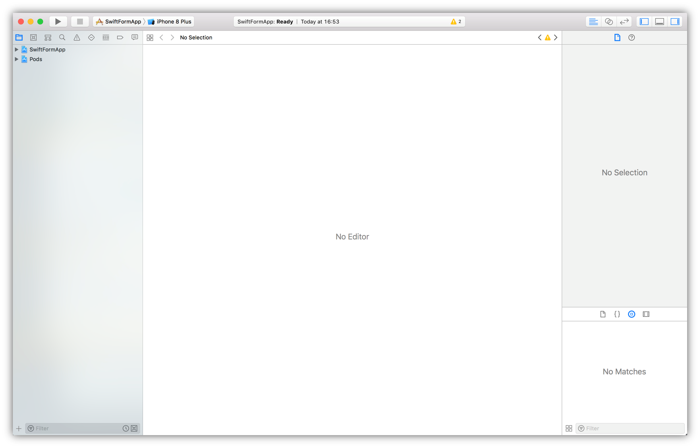]

.size_small_7[.color_red[__注意__]<br>青いアイコンの「SwiftFormApp.xcodeproj」からXcodeを起動しても動作しません。<br>必ず白いアイコンの「SwiftFormApp.xcworkspace」から起動してください。]

---
.footnote_right[
.right[
ハンズオン<br>2. Xcode の準備
]
]
### mobile backend APIキーの設定と SDKの初期化

* `AppDelegate.swift` を開きます

.center[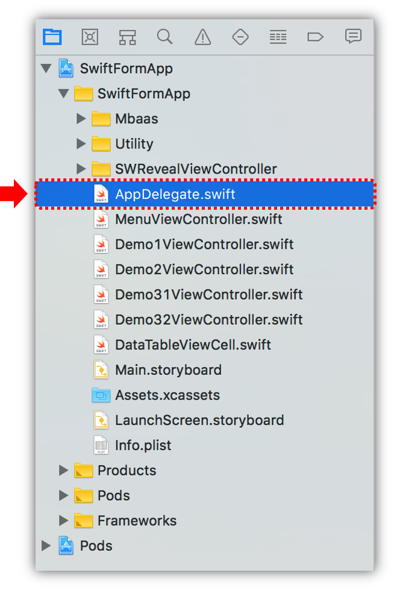]

---
.footnote_right[
.right[
ハンズオン<br>2. Xcode の準備
]
]
### mobile backend APIキーの設定と SDKの初期化

* `YOUR_NCMB_APPLICATION_KEY` と `YOUR_NCMB_CLIENT_KEY` を mobile backend でアプリ作成時に発行された２つの APIキー （アプリケーションキーとクライアントキー）に貼り替えます

.center[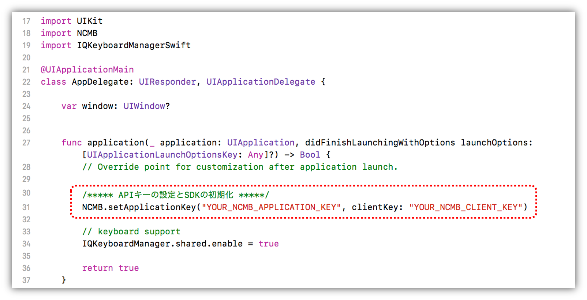]

---
.footnote_right[
.right[
ハンズオン<br>2. Xcode の準備
]
]
### mobile backend APIキーの設定と SDKの初期化

* APIキーは mobile backend 管理画面の「アプリ設定」で確認できます

.center[]

* こんな感じになればOKです

.center[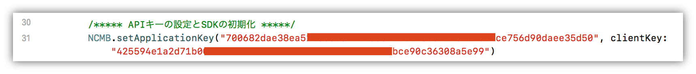]

* 書き換えたら必ず保存をしましょう
  * `command + S` キーで保存できます

これで準備はすべて完了です。

---
layout: true
class: center, middle, inverse_sub
---
# 2. コーディングと<br>　動作確認・解説

---
layout: false

.footnote_right[
.right[
ハンズオン<br>1. コーディングの進め方について
]
]

## 1. コーディングの進め方について

* `Mbaas.swift` を開いて必要なコードを記述していきます

.center[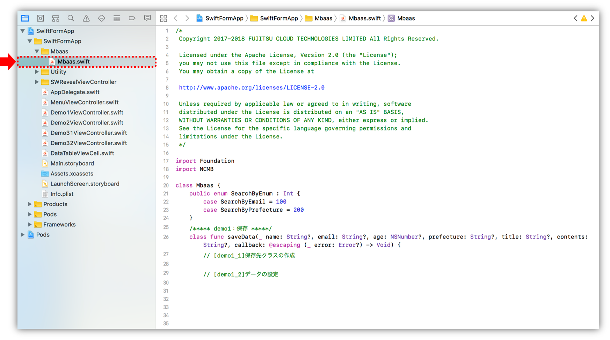]

* mobile backend との連携部分に関する処理は全てこのファイルに記述します

---
.footnote_right[
.right[
ハンズオン<br>1. コーディングの進め方について
]
]

* 必要なコードが虫食い状態になっていますので、ステップごとに１つずつコーディングしてアプリを完成させていきましょう

.center[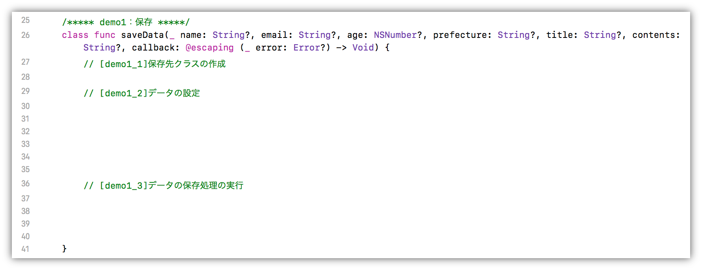]


---
.footnote_right[
.right[
ハンズオン<br>2. 『demo1：保存』
]
]

## 2. 『demo1：保存』

.left-column[
* 問い合わせフォームに記入した情報を「送信」ボタンをクリックすることでクラウドデータベースに保存する処理を実装します
]

.right-column[
.center[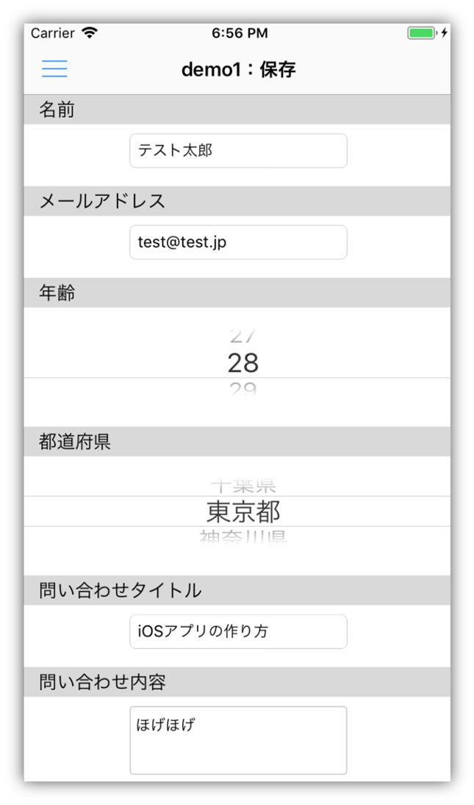]
]

---
.footnote_right[
.right[
ハンズオン<br>2. 『demo1：保存』
]
]

### 『demo1：保存』コーディング

* 問い合わせデータを保存するクラス「Inquiry」を作成します

```swift
// [demo1_1]保存先クラスの作成
let object = NCMBObject(className: "Inquiry")
```

* `Inquiry` の部分を変えれば他のクラスを生成することができます
* クラスの新規・既存問わず、同じコードでクラスを作成・指定することができます

---
.footnote_right[
.right[
ハンズオン<br>2. 『demo1：保存』
]
]

### 『demo1：保存』コーディング

* 問い合わせフォームの入力値を設定します

```swift
// [demo1_2]データの設定
object?.setObject(name, forKey: "name")
object?.setObject(email, forKey: "emailAddress")
object?.setObject(age, forKey: "age")
object?.setObject(prefecture, forKey: "prefecture")
object?.setObject(title, forKey: "title")
object?.setObject(contents, forKey: "contents")
```

`.setObject(Key, forKey: value)` : フィールド「Key」にデータ「value」の設定

---
.footnote_right[
.right[
ハンズオン<br>2. 『demo1：保存』
]
]

### 『demo1：保存』コーディング

* 設定したデータで保存をします

```swift
// [demo1_3]データの保存処理の実行
object?.saveInBackground({error in
    // 保存成功or失敗時の処理
    callback(error)
})
```

`.saveInBackground()` : データの保存処理

---
.footnote_right[
.right[
ハンズオン<br>2. 『demo1：保存』
]
]

### 『demo1：保存』動作確認

.left-column[
* 好みの Simulator を選択して、アプリを実行します

.center[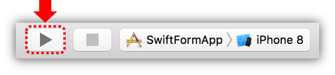]

* Simulator が起動したら、「demo1：保存」画面の問い合わせフォームに情報を入力して「送信」をタップします
]

.right-column[
.center[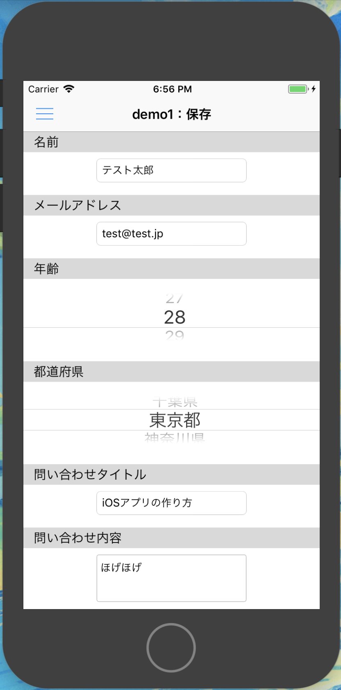]
]

---
.footnote_right[
.right[
ハンズオン<br>2. 『demo1：保存』
]
]

### 『demo1：保存』動作確認

* 確認ダイアロで「保存成功」と表示されれば正しく mobile backend 上にデータが格納されています

.center[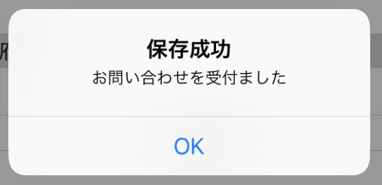]

* クラウドにデータが保存されていることを実際に確認してみましょう

---
.footnote_right[
.right[
ハンズオン<br>2. 『demo1：保存』
]
]

### 『demo1：保存』動作確認

* mobile backend を開きます
* `データストア` を開くと 「`Inquiry`」というクラスが作成されていて、その中にデータが格納されていることを確認できます

.center[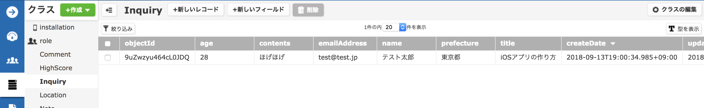]

---
.footnote_right[
.right[
ハンズオン<br>3. 『demo2：全件検索』
]
]

## 3. 『demo2：全件検索』

.left-column[
* クラウドデータベース上に保存された問い合わせデータを取得し、一覧としてアプリに表示する処理を実装します
]

.right-column[
.center[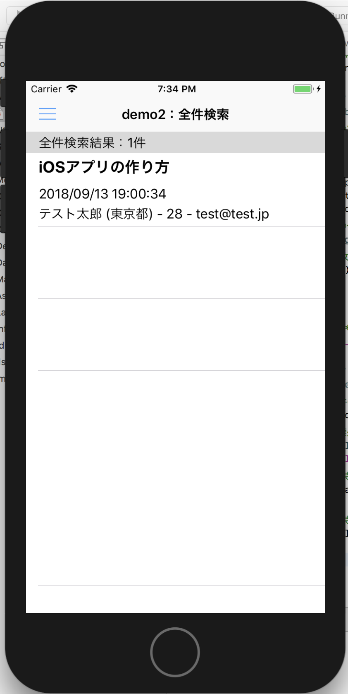]
]

---
.footnote_right[
.right[
ハンズオン<br>3. 『demo2：全件検索』
]
]

### 『demo2：全件検索』コーディング

* 問い合わせデータ保存先クラス「Inquiry」を検索するためのクエリを作成します

```swift
// [demo2_1]保存先クラスのクエリを生成
let query = NCMBQuery(className: "Inquiry")
```

---
.footnote_right[
.right[
ハンズオン<br>3. 『demo2：全件検索』
]
]

### 『demo2：全件検索』コーディング

* 問い合わせ日時の降順を指定します

```swift
// [demo2_2]検索条件の設定（保存日時の降順）
query?.order(byDescending: "createDate")
```

`.order(byAscending: "createDate")` : 保存日時の昇順<br>
`.order(byDescending: "createDate")` : 保存日時の降順

---
.footnote_right[
.right[
ハンズオン<br>3. 『demo2：全件検索』
]
]

### 『demo2：全件検索』コーディング

* 問い合わせデータを全て検索して取得します

```swift
// [demo2_3]全件検索処理の実行
query?.findObjectsInBackground({ objects, error in
    if error != nil {
        // 検索失敗時の処理
        errorCallback(error)
    } else {
        // 検索成功時の処理
        successCallback(objects)
    }
})
```

`.findObjectsInBackground()` : 検索取得処理

---
.footnote_right[
.right[
ハンズオン<br>3. 『demo2：全件検索』
]
]

### 『demo2：全件検索』動作確認

.left-column[
* 再び Simulator アプリを実行します
* Simulator が起動したら、左上メニューから「demo2：全件検索」画面に移動します
]

.right-column[
.center[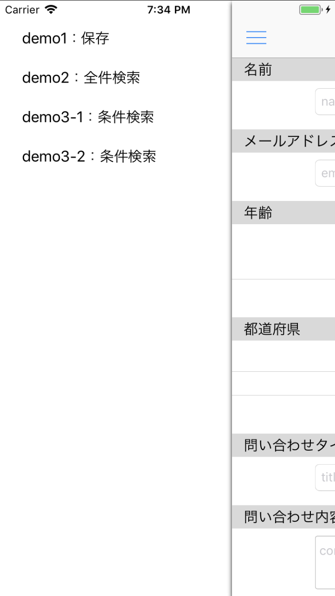]
]

---
.footnote_right[
.right[
ハンズオン<br>3. 『demo2：全件検索』
]
]

### 『demo2：全件検索』動作確認

.left-column[
* 「demo2：全件検索」画面が表示されたタイミングで mobile backend からデータを取得します
  * さらに「demo2：全件検索」画面に一覧として表示されるよう実装しています
* 「『demo1：保存』動作確認」で送信した問い合わせデータが表示されます
]

.right-column[
.center[]
]

---
.footnote_right[
.right[
ハンズオン<br>3. 『demo2：全件検索』
]
]

### 『demo2：全件検索』動作確認

.left-column[
__参考__<br>
問い合わせデータをタップすると、「問い合わせ内容」をダイアログで確認できるように実装しています
]

.right-column[
.center[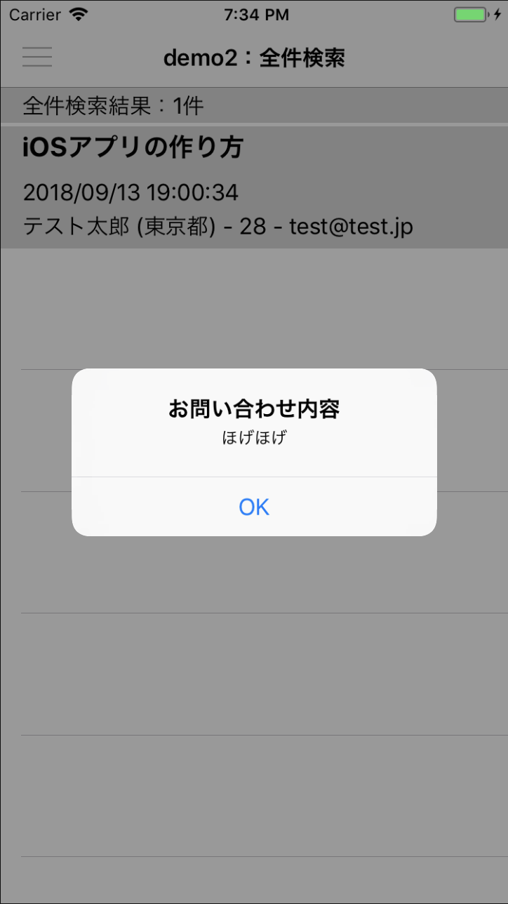]
]

---
.footnote_right[
.right[
ハンズオン<br>3. 『demo2：全件検索』
]
]

### 『demo2：全件検索』動作確認

.left-column[
* 再び「demo1：保存」画面に戻って、複数件問い合わせデータを送信してから「demo2：全件検索」画面を開いてみましょう
* 例としてダミーデータを10件登録した場合はこんな感じになります
* 検索についてのコードも確認してみましょう！
]

.right-column[
.center[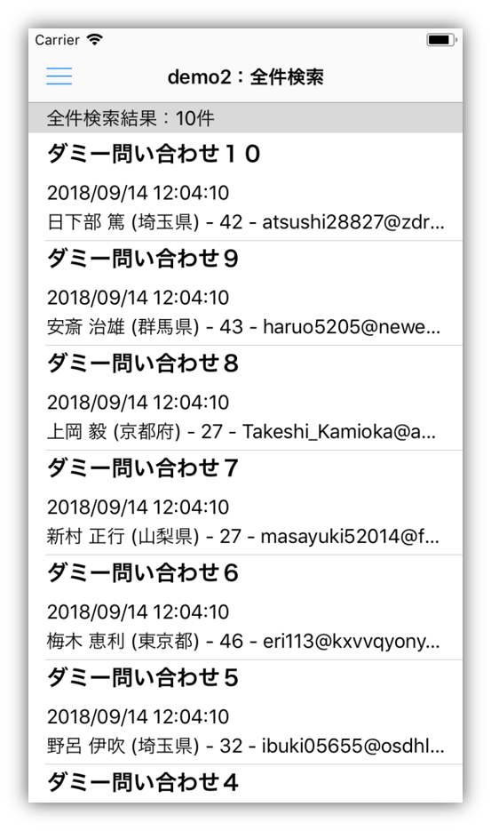]
]

---
.footnote_right[
.right[
ハンズオン<br>3. 『demo2：全件検索』
]
]

### 『demo2：全件検索』動作確認

__参考__<br>
CSVファイルを使ってデータを一括でアップロードすることも可能です。データストアの「Inquery」クラスを一度削除してから改めて「Inquery」でクラス名を指定し、下記内容で作成したCSVファイルをインポートしてください。

.size_small_7[
.color_blue[__＜サンプルCSV＞ダミーデータ10件__]

```csv
name,emailAddress,age,prefecture,title,contents
"西口 理紗","anishiguchi@jyciupeuy.com",47,"北海道","ダミー問い合わせ１","ダミー問い合わせ１"
"大倉 麻衣子","maiko895@jbvh.co.jp",38,"東京都","ダミー問い合わせ２","ダミー問い合わせ２"
"寺崎 夏実","Natsumi_Terasaki@kpxwno.com",50,"兵庫県","ダミー問い合わせ３","ダミー問い合わせ３"
"立石 重行","itateishi@mcicjxmqug.jp",35,"秋田県","ダミー問い合わせ４","ダミー問い合わせ４"
"野呂 伊吹","ibuki05655@osdhl.com",32,"埼玉県","ダミー問い合わせ５","ダミー問い合わせ５"
"梅木 恵利","eri113@kxvvqyony.co.jp",46,"東京都","ダミー問い合わせ６","ダミー問い合わせ６"
"新村 正行","masayuki52014@fksllu.uk",27,"山梨県","ダミー問い合わせ７","ダミー問い合わせ７"
"上岡 毅","Takeshi_Kamioka@akyck.jp",27,"京都府","ダミー問い合わせ８","ダミー問い合わせ８"
"安斎 治雄","haruo5205@newek.com",43,"群馬県","ダミー問い合わせ９","ダミー問い合わせ９"
"日下部 篤","atsushi28827@zdrqbkomh.jp",42,"埼玉県","ダミー問い合わせ１０","ダミー問い合わせ１０"
```

.color_red[__注意__]<br>
CSVファイル作成時、日本語の文字化けを防ぐために、文字コードをUTF-8にして保存してください。また、文字コードが UTF-8 でも BOM がついているファイルをインポートしようとするとエラーになります。
<br>※詳しい操作方法は [ドキュメントページ](https://mbaas.nifcloud.com/doc/current/datastore/basic_usage_ios.html#ファイルからクラスをインポートする) を参照

]

---
.footnote_right[
.right[
ハンズオン<br>4. 『demo3：条件検索』
]
]

## 4. 『demo3：条件検索』

* 保存された問い合わせデータから特定のデータを絞り込んで、一覧としてアプリに表示する処理を記述します

.center[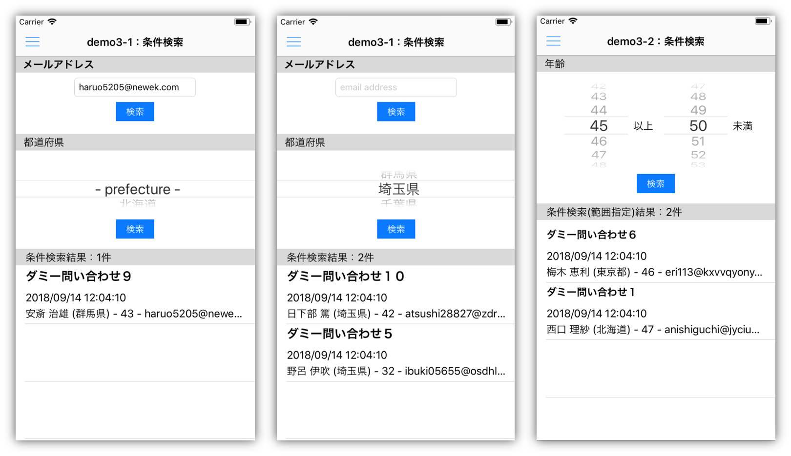]

---
.footnote_right[
.right[
ハンズオン<br>4. 『demo3：条件検索』
]
]

### 『demo3-1：条件検索』（完全一致）コーディング

.left-column[
* demo3-1ではメールアドレスと都道府県による「完全一致」検索を行いデータを取得する処理を記述します

]

.right-column[
.center[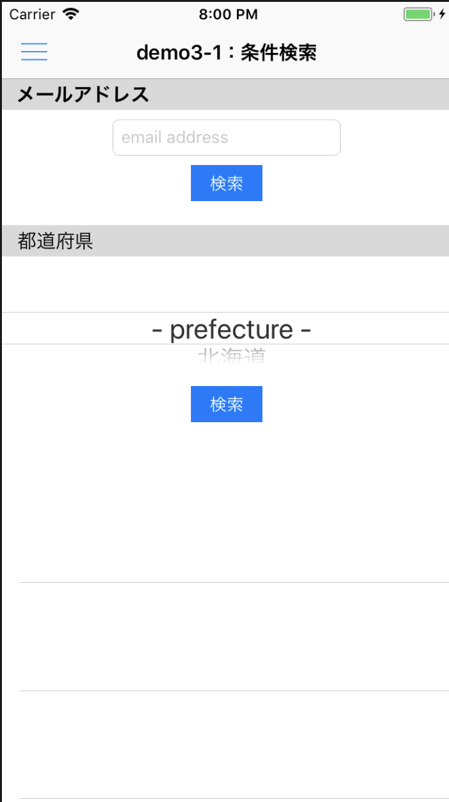]
]

---
.footnote_right[
.right[
ハンズオン<br>4. 『demo3：条件検索』
]
]

### 『demo3-1：条件検索』（完全一致）コーディング

* demo2と同様に、問い合わせデータ保存先クラス「Inquiry」を検索するためのクエリを作成、条件として問い合わせ日時の降順を指定します

```Swift
// [demo3-1_1]保存先クラスのクエリを生成
let query = NCMBQuery(className: "Inquiry")
```
```swift
// [demo3-1_2]検索条件の設定（保存日時の降順）
query?.order(byDescending: "createDate")
```

---
.footnote_right[
.right[
ハンズオン<br>4. 『demo3：条件検索』
]
]

### 『demo3-1：条件検索』（完全一致）コーディング

タップされる「検索」ボタンにより処理が分かれます

* 入力したメールアドレスと一致するデータを指定します

```Swift
// [demo3-1_3]検索条件（メールアドレス）の設定
query?.whereKey("emailAddress", equalTo: q)
```

* 選択した都道府県と一致するデータを指定します

```swift
// [demo3-1_4]検索条件（都道府県）の設定
query?.whereKey("prefecture", equalTo: q)
```

`.whereKey(Key, equalTo: Value)` :<br>　　　　　　　　　フィールド「Key」の値が、「Value」と等しいデータを指定

---
.footnote_right[
.right[
ハンズオン<br>4. 『demo3：条件検索』
]
]

### 『demo3-1：条件検索』（完全一致）コーディング

* demo2と同様に、問い合わせデータを全て検索して取得します

```swift
// [demo3-1_5]全件検索処理の実行
query?.findObjectsInBackground({ objects, error in
    if error != nil {
        //検索失敗時の処理
        errorCallback(error)
    } else {
        //検索成功時の処理
        successCallback(objects)
    }
})
```

* 条件設定が異なるだけで検索の仕方は同様です

---
.footnote_right[
.right[
ハンズオン<br>4. 『demo3：条件検索』
]
]

### 『demo3-1：条件検索』（完全一致）動作確認

.left-column[
* 再び Simulator アプリを実行します
* Simulator が起動したら、左上メニューから「demo3-1：条件検索」画面に移動します
* メールアドレスまたは都道府県を指定して「検索」ボタンをタップします
]

.right-column[
.center[]
]

---
.footnote_right[
.right[
ハンズオン<br>4. 『demo3：条件検索』
]
]

### 『demo3-1：条件検索』（完全一致）動作確認

検索結果例

.center[]


---
.footnote_right[
.right[
ハンズオン<br>4. 『demo3：条件検索』
]
]

### 『demo3-1：条件検索』（完全一致）動作確認

.left-column[
.color_red[__注意__]<br>
* **完全一致** 検索になるので部分一致による検索はできません
  * 部分一致検索が必要な場合は、アプリ内で実装が必要です
]

.right-column[
.center[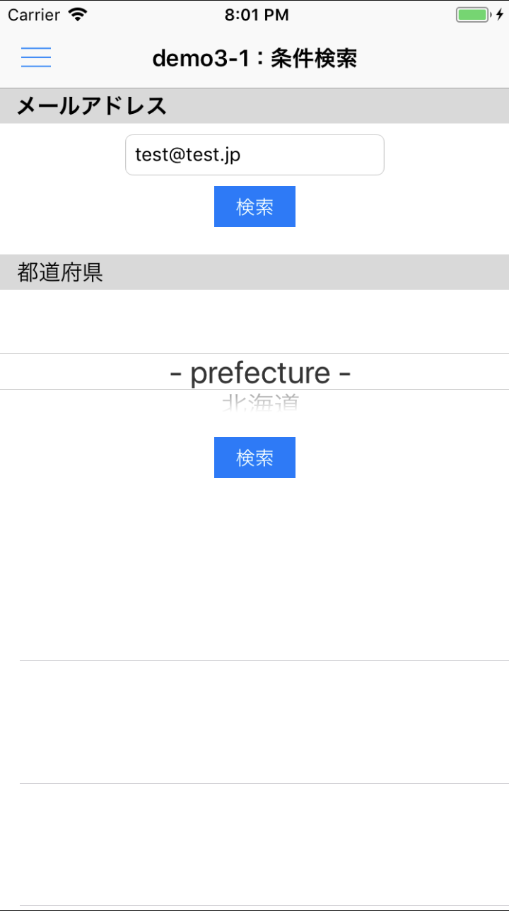]
]

---
.footnote_right[
.right[
ハンズオン<br>4. 『demo3：条件検索』
]
]

### 『demo3-2：条件検索』（～以上～未満）コーディング

.left-column[
* demo3-2では年齢の「範囲を指定」して検索を行いデータを取得する処理を記述します]

.right-column[
.center[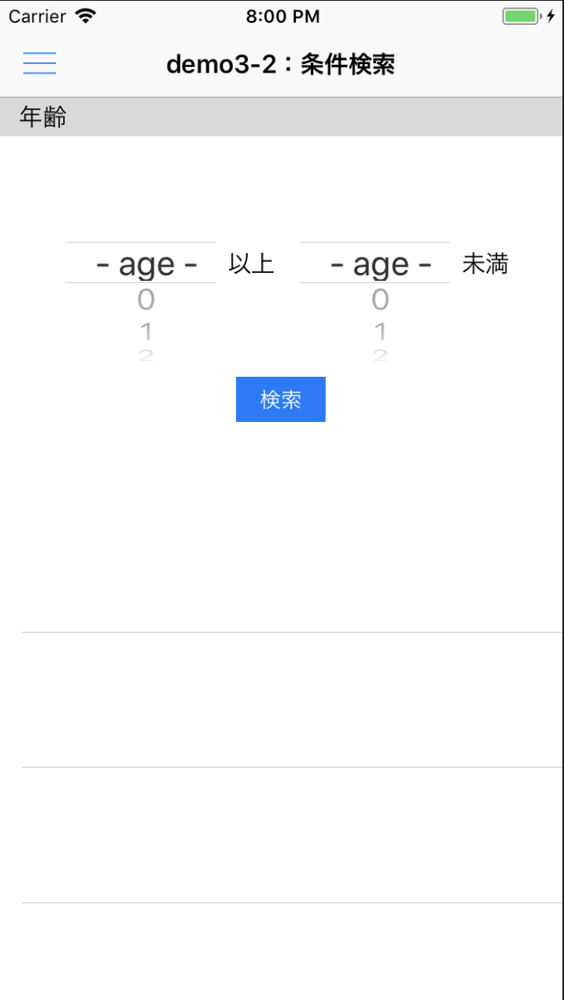]
]

---
.footnote_right[
.right[
ハンズオン<br>4. 『demo3：条件検索』
]
]

### 『demo3-2：条件検索』（～以上～未満）コーディング

* クラスの検索クエリの生成、保存日時の降順を指定についてはdemo2, demo3-1と同様に記述します

```swift
// [demo3-2_1]保存先クラスのクエリを生成
let query = NCMBQuery(className: "Inquiry")
```

```swift
// [demo3-2_2]検索条件の設定（保存日時の降順）
query?.order(byDescending: "createDate")
```
---
.footnote_right[
.right[
ハンズオン<br>4. 『demo3：条件検索』
]
]

### 『demo3-2：条件検索』（～以上～未満）コーディング

* 年齢の値を範囲（以上未満）で指定します

```swift
// [demo3-2_3]検索条件（年齢）の設定（○○歳以上）
query?.whereKey("age", greaterThanOrEqualTo: ageGreaterThan)
```

```swift
// [demo3-2_4]検索条件（年齢）の設定（○○歳未満）
query?.whereKey("age", lessThan: ageLessThan)
```

`.whereKey(Key, greaterThanOrEqualTo: value)` : <br>　　　　　　　　　　フィールド「Key」の値が「Value」以上のデータを指定<br>
`.whereKey(Key, lessThan: value)` : <br>　　　　　　　　　　フィールド「Key」の値が「Value」未満のデータを指定<br>

.size_small_7[（参考）<br>
`.whereKey(Key, greaterThan: value)` : フィールド「Key」の値が「Value」より大きいデータを指定<br>
`.whereKey(Key, lessThanOrEqualTo: value)` : フィールド「Key」の値が「Value」以下のデータを指定<br>
]

---
.footnote_right[
.right[
ハンズオン<br>4. 『demo3：条件検索』
]
]

### 『demo3-2：条件検索』（～以上～未満）コーディング
#### （参考）AND検索（A かつ B）

.size_small_7[
```swift
// 10以上50未満
let query = NCMBQuery(className: "Inquiry")
query?.whereKey("age", greaterThanOrEqualTo: 10)
query?.whereKey("age", lessThan: 50)
query?.findObjectsInBackground({ (error) in
    if error != nil {

    }else{

    }
})
```
]

#### （参考）OR検索（A または B）

.size_small_7[
```swift
// 10未満または50以上
let subQuery1 = NCMBQuery(className: "Inquiry")
subQuery1?.whereKey("age", lessThan: 10)
let subQuery2 = NCMBQuery(className: "Inquiry")
subQuery2?.whereKey("age", greaterThanOrEqualTo: 50)
let query = NCMBQuery.orQuery(withSubqueries: [subQuery1!, subQuery2!])
query?.findObjectsInBackground({ (error) in
    if error != nil {

    }else{

    }
})
```

* サブクエリを作成して `.orQuery` メソッドで合成します
]

---
.footnote_right[
.right[
ハンズオン<br>4. 『demo3：条件検索』
]
]

### 『demo3-2：条件検索』（～以上～未満）コーディング

* 検索処理もdemo2, demo3-1と同様に実装します

```swift
// [demo3-2_5]全件検索処理の実行
query?.findObjectsInBackground({ objects, error in
    if error != nil {
        // 検索失敗時の処理
        errorCallback(error)
    } else {
        // 検索成功時の処理
        successCallback(objects)
    }
}
```

---
.footnote_right[
.right[
ハンズオン<br>4. 『demo3：条件検索』
]
]

### 『demo3-2：条件検索』（～以上～未満）動作確認

.left-column[
* 再び Simulator アプリを実行します
* Simulator が起動したら、左上メニューから「demo3-2：条件検索」画面に移動します
* 年齢の範囲を指定して「検索」ボタンをタップします
]

.right-column[
.center[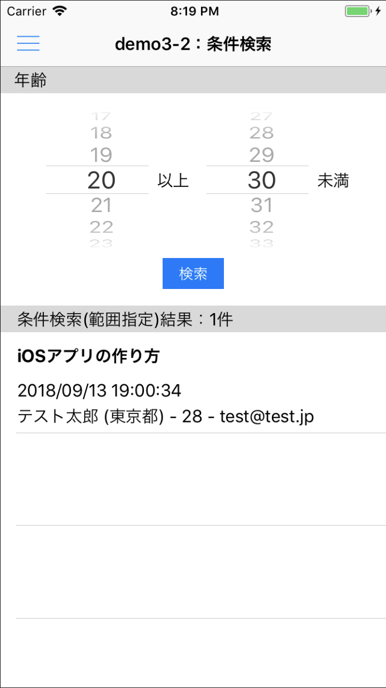]
]

---
.footnote_right[
.right[
ハンズオン<br>5. おまけ
]
]

## 5. おまけ
### データの削除

```swift
// データの削除
objct?.deleteInBackground({ (error) in
    if error != nil {
        // 削除に失敗した場合の処理
    }else{
        // 削除に成功した場合の処理
    }
})
```

### データの更新

* 保存済み（objectIdを持っている）オブジェクトに新しい値をセットして
`saveInBackgroundWithBlock` メソッドを実行することで更新できます


---
.footnote_right[
.right[
ハンズオン<br>5. おまけ
]
]

### その他 mobile backend でできること
#### データストアの機能
* **ポインタ・リレーション**
  * データ同士を関連付けすることができます
* **参照権限（ACL）**
  * データの読み書きを制限できます

（参考）[データストア \(iOS\) : 基本的な使い方 \| ニフクラ mobile backend](https://mbaas.nifcloud.com/doc/current/datastore/basic_usage_ios.html)
---
.footnote_right[
.right[
まとめ
]
]

## まとめ


ニフクラ mobile backend クラウドデータベースの活用方法を学びました

.left-column[
.size_large_11[
* データの保存
* データの全件検索取得
* データの条件検索取得
]
]

.right-column[
.right[
.color_blue[
<br>
今後のアプリ開発の<br>参考にしていただけたら幸いです！
]


.size_small_7[
ニフクラ mobile backend イメージキャラクター<br>タカノくん
]
]
]

---
layout: true
class: center, middle, inverse_sub
---
.center[
## ご清聴ありがとうございました！
]
