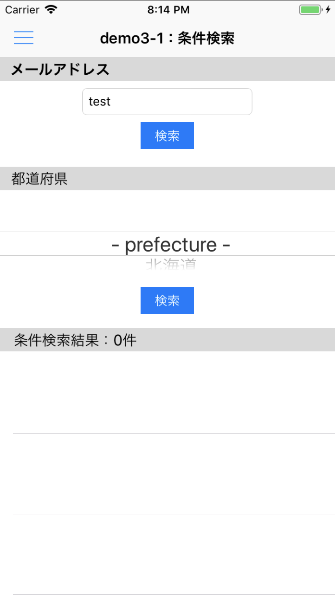

name: inverse
layout: true
class: center, middle, inverse
---
# クラウドデータベース<br>基礎マスター講座<br><span style="font-size: 50%">for iOS（Swift）</span>
富士通クラウドテクノロジーズ株式会社

.right[]

.footnote[
2018/09/18作成
]

---
layout: true
class: center, middle, inverse_sub
---
# はじめに

---
layout: false

.footnote_right[
はじめに
]

## セミナー概要
__問い合わせフォーム__ をイメージしたサンプルアプリを通して、クラウドデータベースへの保存と検索の方法を学んでいきます

.center[]

---
.footnote_right[
はじめに
]

## データをクラウドに保存する<br>３つのメリット

.size_large_13[
1. 保存した瞬間、瞬時にデータを共有できる
1. 機種変更やアプリをアンインストールしても<br>データがなくならない
1. アプリにデータを持たないのでアプリの容量を軽くできる
]

.center[]

---
.footnote_right[
はじめに
]
## 今回習得できる内容
### クラウドデータベースの基本的な使い方
#### データの保存

.center[]

---
.footnote_right[
はじめに
]
## 今回習得できる内容
### クラウドデータベースの基本的な使い方
#### データの取得

.center[]

---
.footnote_right[
はじめに
]
## 今回習得できる内容
### クラウドデータベースの基本的な使い方
#### データの条件検索取得（完全一致検索・範囲指定検索）

.center[]

---
.footnote_right[
はじめに
]
## 今回習得できる内容
### おまけ

* データの削除
* データの更新
* その他 ニフクラ mobile backned でできること

---
.footnote_right[
はじめに
]
## 今回利用するツール
### ニフクラ mobile backend
__にふくら-もばいる-ばっくえんど 【[ニフクラ mobile backend](http://mb.cloud.nifty.com/about.htm)】__ スマートフォンアプリに必要なバックエンド機能が開発不要で利用できるクラウドサービス。 クラウド上に用意された機能を API で呼び出すだけで利用できます。また、APIを簡単に使うための SDK を用意しています（ iOS / Android / Monaca / Unity ）。mobile Backend as a Service の頭文字を取って、通称 **mBaaS** と呼ばれます。

.center[]

---
layout: true
class: center, middle, inverse_sub
---
# ハンズオン

---
layout: false

.footnote_right[
ハンズオン
]

## 事前準備

.size_large_13[
* Mac と以下の環境を使用します
  * Xcode ver.9 以上推奨
  * ターミナル
* ニフクラ mobile backend の利用登録（無料）
  * http://mb.cloud.nifty.com/signup.htm
  * SNS ID でアカウントを取得してください
]

---
.footnote_right[
.right[
ハンズオン
]
]

## 取り組み内容
_★修正必要_
クラウドデータベースとの連携以外の処理についてコーディング済みのサンプルプロジェクトを利用します。必要な mobile backend との連携部分のコーディングや設定を行うことで、動作確認いただけます。

### 1. 環境準備
.size_large_13[
1. mobile backend の準備
  * アプリの新規作成
1. Xcode の準備
  * サンプルプロジェクトの準備
  * mobile backend iOS SDK の導入
  * サンプルプロジェクトを開く
  * mobile backend APIキーの設定と SDKの初期化
]

ここまでの作業は今回のサンプルアプリに関わらず、mobile backend を利用する場合は必ず実施いただく手順となります。

---
.footnote_right[
.right[
ハンズオン
]
]

### 2. コーディングと動作確認・解説

.size_large_11[
1. 『demo1：保存』
  * 問い合わせフォームに値を入力して保存してみましょう
1. 『demo2：全件検索』
  * 問い合わせデータをアプリ側に取得してみましょう
1. 『demo3：条件検索』（完全一致/～以上～未満）
  * 問い合わせデータを条件を指定して取得してみましょう
  * 問い合わせデータを範囲を指定して取得してみましょう
1. おまけ
  * データの削除
  * データの更新
  * その他 mobile backend でできること
]


---
.footnote_right[
.right[
ハンズオン<br>1.1. mobile backend の準備
]
]

## 1.1. mobile backend の準備
### アプリの新規作成

* mobile backend にログインします

.center[]

https://mbaas.nifcloud.com/

---
.footnote_right[
.right[
ハンズオン<br>1.1. mobile backend の準備
]
]

### アプリの新規作成
* 新しいアプリを作成します
* アプリ名を入力し「`新規作成`」をクリックします　例）.color_blue[__SwiftFormApp__]

_★修正必要_
.center[]


* mobile backend を既に使用したことがある場合は、画面上方のメニューバーにある「`+新しいアプリ`」をクリックすると同じ画面が表示されます

.center[]

---
.footnote_right[
.right[
ハンズオン<br>1.1. mobile backend の準備
]
]

### アプリの新規作成
* アプリが作成されるとAPIキー（２種類）が発行されます
 * APIキーは後で使用します。
* ここでは使用しないので、「OK」で閉じます

_★修正必要_
.center[]

---
.footnote_right[
.right[
ハンズオン<br>2. mobile backend 準備
]
]

### アプリの新規作成
* 管理画面が開かれ、ダッシュボードが表示されます

.center[]

 これで mobile backend の準備は完了です

---
.footnote_right[
.right[
ハンズオン<br>1.2. Xcode の準備
]
]

## 1.2. Xcode の準備
### サンプルプロジェクトの準備

* 下記リンクからプロジェクトをローカルフォルダにダウンロードします

.size_large_15[
.center[
__http://bit.ly/natsumo_SwiftFormApp2__
]
]

* zipファイルを解凍します

.center[]

---
.footnote_right[
.right[
ハンズオン<br>1.2. Xcode の準備
]
]
### mobile backend iOS SDK の導入

Xcode プロジェクト「SwiftFormApp.xcodeproj」はまだ開きません。先に mobile backend を使うための iOS SDK を導入していきます。

* ターミナルを開きます

.center[]


---
.footnote_right[
.right[
ハンズオン<br>1.2. Xcode の準備
]
]
### mobile backend iOS SDK の導入
#### CocoaPods をインストールする（初回のみ）

.color_red[.size_small_7[※ 既にインストール済みの場合は本作業は不要です]]

* ターミナルで以下を実行します
  * cocoaPods のインストール
  ```bash
  $ sudo gem install cocoapods
  ```
  * cocoaPods のセットアップ
  ```bash
  $ pod setup
  ```
  * （確認）バージョン情報
  ```bash
  $ pod --version
  ```

---
.footnote_right[
.right[
ハンズオン<br>1.2. Xcode の準備
]
]
### mobile backend iOS SDK の導入
#### SDK のインストール

* ターミナルで以下を実行します
  * Xcode プロジェクト「SwiftFormApp.xcodeproj」と同じディレクトリに移動
  ```bash
  $ cd 'プロジェクトパス'
  ```
* 通常はここでインストールするライブラリを指定するファイル「Podfile」を作成し編集して利用しますが、今回のサンプルには既に Podfile を準備していますのでそちらを使用します
  * （参考）Podfile 作成 .color_red[.size_small_7[※ ここでは実行不要です]]
  ```bash
  $ pod init
  ```

---
.footnote_right[
.right[
ハンズオン<br>1.2. Xcode の準備
]
]
### mobile backend iOS SDK の導入
#### SDK のインストール

* Xcode プロジェクト「SwiftFormApp.xcodeproj」と同じディレクトリ内にある「Podfile」を確認します

```ruby
# Uncomment the next line to define a global platform for your project
platform :ios, '10.0'

target 'SwiftFormApp' do
  # Comment the next line if you're not using Swift and don't want to use dynamic frameworks
  use_frameworks!

  # Pods for SwiftFormApp
  pod 'NCMB', :git => 'https://github.com/NIFCloud-mbaas/ncmb_ios.git'
  pod 'UITextView+Placeholder'
  pod 'ProgressHUD'
  pod 'IQKeyboardManagerSwift'

end
```

---
.footnote_right[
.right[
ハンズオン<br>1.2. Xcode の準備
]
]
### mobile backend iOS SDK の導入
#### SDK のインストール

* ターミナルで以下を実行します
  * podfileに書いた内容で SDK をインストール
  ```bash
  $ pod install
  ```
  * 基本は上記コマンドでインストールを行いますが、短時間でインストールが必要な場合は下記が利用可能です
  ```bash
  $ pod install --no-repo-update
  ```
* プロジェクト「SwiftFormApp.xcworkspace」が作成されます

.center[]

---
.footnote_right[
.right[
ハンズオン<br>1.2. Xcode の準備
]
]
### サンプルプロジェクトを開く

* 作成されたプロジェクト「SwiftFormApp.xcworkspace」をダブルクリックして開きます
* Xcode が起動し、プロジェクトが開かれます

.center[]

.color_red[.size_small_7[※ 青いアイコンの「SwiftFormApp.xcodeproj」では動作しません。<br>　 必ず白いアイコンの「SwiftFormApp.xcworkspace」を開きます。]]


---
.footnote_right[
.right[
ハンズオン<br>1.2. Xcode の準備
]
]
### mobile backend APIキーの設定と SDKの初期化

* `AppDelegate.swift` を開きます

.center[]

---
.footnote_right[
.right[
ハンズオン<br>1.2. Xcode の準備
]
]
### mobile backend APIキーの設定と SDKの初期化

* `YOUR_NCMB_APPLICATION_KEY` と `YOUR_NCMB_CLIENT_KEY` を mobile backend でアプリ作成時に発行された２つの APIキー （アプリケーションキーとクライアントキー）に貼り替えます

.center[]

---
.footnote_right[
.right[
ハンズオン<br>1.2. Xcode の準備
]
]
### mobile backend APIキーの設定と SDKの初期化

* APIキーは mobile backend 管理画面の「アプリ設定」で確認できます

_★修正必要_
.center[]

* こんな感じになればOKです

.center[]

* 書き換えたら必ず保存をしましょう
  * `command + S` キーで保存できます

これで準備はすべて完了です。

---
.footnote_right[
.right[
ハンズオン<br>2.0. コーディングの進め方について
]
]

## 2.0. コーディングの進め方について

* `Mbaas/Mbaas.swift` を開いて必要なコードを記述していきます
* mobile backend との連携部分に関する処理は全てこのファイルに記述します
* 必要なコードが虫食い状態になっていますので、ステップごとに１つずつコーディングしてアプリを完成させていきましょう

---
.footnote_right[
.right[
ハンズオン<br>2.1. 『demo1：保存』
]
]

## 2.1. 『demo1：保存』
### 『demo1：保存』コーディング

.left-column[
* 問い合わせフォームに記入した情報を「送信」ボタンをクリックすることでクラウドデータベースに保存する処理を記述します
]

.right-column[
.center[]
]

---
.footnote_right[
.right[
ハンズオン<br>2.1. 『demo1：保存』
]
]

### 『demo1：保存』コーディング

* 問い合わせデータを保存するクラス「Inquiry」を作成します

```swift
// [demo1_1]保存先クラスの作成
let object = NCMBObject(className: "Inquiry")
```

`Inquiry` の部分を変えれば他のクラスを生成することができます。また、クラスの新規・既存問わず、同じコードでクラスを指定することができます。

---
.footnote_right[
.right[
ハンズオン<br>2.1. 『demo1：保存』
]
]

### 『demo1：保存』コーディング

* 問い合わせフォームの入力値を設定します

```swift
// [demo1_2]データの設定
object?.setObject(name, forKey: "name")
object?.setObject(email, forKey: "emailAddress")
object?.setObject(age, forKey: "age")
object?.setObject(prefecture, forKey: "prefecture")
object?.setObject(title, forKey: "title")
object?.setObject(contents, forKey: "contents")
```

`.setObject(Key, forKey: value)` : データの設定

---
.footnote_right[
.right[
ハンズオン<br>2.1. 『demo1：保存』
]
]

### 『demo1：保存』コーディング

* 設定したデータで保存をします

```swift
// [demo1_3]データの保存処理の実行
object?.saveInBackground({error in
    // 保存成功or失敗時の処理
    callback(error)
})
```

`.saveInBackground()` : データの保存処理

---
.footnote_right[
.right[
ハンズオン<br>2.1. 『demo1：保存』
]
]

### 『demo1：保存』動作確認

.left-column[
* 好みの Simulator を選択して、プログラムを実行します

.center[]

* Simulator が起動したら、問い合わせフォームに情報を入力して「送信」をタップします
]

.right-column[
.center[]
]

---
.footnote_right[
.right[
ハンズオン<br>2.1. 『demo1：保存』
]
]

### 『demo1：保存』動作確認

* 確認 Alert が出れば保存成功です

.center[]

…本当にクラウドにデータが保存されているのでしょうか？<br>確認してみましょう！


---
.footnote_right[
.right[
ハンズオン<br>2.1. 『demo1：保存』
]
]

### 『demo1：保存』動作確認

保存されたデータを確認してみましょう！

* mobile backend を開きます
* `データストア` を開くと 「`Inquiry`」というクラスが作成されていて、その中にデータが格納されていることを確認できます

.center[]
.center[]


---
.footnote_right[
.right[
ハンズオン<br>2.2. 『demo2：全件検索』
]
]

## 2.2. 『demo2：全件検索』
### 『demo2：全件検索』コーディング

.left-column[
* 問い合わせフォームから送信され、クラウドデータベース上に保存されたデータを取得し、一覧としてアプリに表示する処理を記述します
]

.right-column[
.center[]
]

---
.footnote_right[
.right[
ハンズオン<br>2.2. 『demo2：全件検索』
]
]

## 2.2. 『demo2：全件検索』
### 『demo2：全件検索』コーディング

* 問い合わせデータ保存先クラス「Inquiry」を検索するためのクエリを作成します

```swift
// [demo2_1]保存先クラスのクエリを生成
let query = NCMBQuery(className: "Inquiry")
```

---
.footnote_right[
.right[
ハンズオン<br>2.2. 『demo2：全件検索』
]
]

## 2.2. 『demo2：全件検索』
### 『demo2：全件検索』コーディング

* 問い合わせ日時の降順を指定します

```swift
// [demo2_2]検索条件の設定（保存日時の降順）
query?.order(byDescending: "createDate")
```

`.order(byAscending: "createDate")` : 保存日時の昇順

---
.footnote_right[
.right[
ハンズオン<br>2.2. 『demo2：全件検索』
]
]

## 2.2. 『demo2：全件検索』
### 『demo2：全件検索』コーディング

* 問い合わせデータを全て検索して取得します

```swift
// [demo2_3]全件検索処理の実行
query?.findObjectsInBackground({ objects, error in
    if error != nil {
        // 検索失敗時の処理
        errorCallback(error)
    } else {
        // 検索成功時の処理
        successCallback(objects)
    }
})
```

`.findObjectsInBackground()` : 検索取得処理

* `order('createDate',true)` :  保存日時の降順を指定
* `fetchAll()` : 全件検索取得


---
.footnote_right[
.right[
ハンズオン<br>2.2. 『demo2：全件検索』
]
]

### 『demo2：全件検索』動作確認

* 左上メニューからdemo2画面に移動します

.center[]

---
.footnote_right[
.right[
ハンズオン<br>2.2. 『demo2：全件検索』
]
]

### 『demo2：全件検索』動作確認

.left-column[
* demo2 画面が表示されたタイミングで mobile backend から登録データを取得し、画面に表示するように実装しています
* この時点では１件しか登録していないので、登録された１件だけ表示されます
]

.right-column[
.center[]
]

---
.footnote_right[
.right[
ハンズオン<br>2.2. 『demo2：全件検索』
]
]

### 『demo2：全件検索』動作確認

.left-column[
* 問い合わせデータをタップすると、問い合わせ内容がアラートで表示されます
]

.right-column[
.center[]
]

---
.footnote_right[
.right[
ハンズオン<br>2.2. 『demo2：全件検索』
]
]

### 『demo2：全件検索』動作確認

.left-column[
* demo1 画面から複数件登録してから、もう一度 demo2 を見てみましょう
* 例としてダミーデータを10件登録した場合はこんな感じになります
* 検索についてのコードも確認してみましょう！
]

.right-column[
.center[]
]


---
.footnote_right[
.right[
ハンズオン<br>2.3. 『demo3：全件検索』
]
]

## 2.3. 『demo3：条件検索』
### 『demo3-1：条件検索』（完全一致）コーディング

.left-column[
* 保存された問い合わせデータから特定のデータを絞り込んで、一覧としてアプリに表示する処理を記述します
]

.right-column[
.center[]
]

---
.footnote_right[
.right[
ハンズオン<br>2.3. 『demo3：全件検索』
]
]

## 2.3. 『demo3：条件検索』
### 『demo3-1：条件検索』（完全一致）コーディング


```Swift
// [demo3-1_1]保存先クラスのクエリを生成
let query = NCMBQuery(className: "Inquiry")
```

---
.footnote_right[
.right[
ハンズオン<br>2.3. 『demo3：全件検索』
]
]

## 2.3. 『demo3：条件検索』
### 『demo3-1：条件検索』（完全一致）コーディング

```swift
// [demo3-1_2]検索条件の設定（保存日時の降順）
query?.order(byDescending: "createDate")
```

---
.footnote_right[
.right[
ハンズオン<br>2.3. 『demo3：全件検索』
]
]

## 2.3. 『demo3：条件検索』
### 『demo3-1：条件検索』（完全一致）コーディング


```Swift
// [demo3-1_3]検索条件（メールアドレス）の設定
query?.whereKey("emailAddress", equalTo: q)
```

---
.footnote_right[
.right[
ハンズオン<br>2.3. 『demo3：全件検索』
]
]

## 2.3. 『demo3：条件検索』
### 『demo3-1：条件検索』（完全一致）コーディング

```swift
// [demo3-1_4]検索条件（都道府県）の設定
query?.whereKey("prefecture", equalTo: q)
```

---
.footnote_right[
.right[
ハンズオン<br>2.3. 『demo3：全件検索』
]
]

## 2.3. 『demo3：条件検索』
### 『demo3-1：条件検索』（完全一致）コーディング

```swift
// [demo3-1_5]全件検索処理の実行
query?.findObjectsInBackground({ objects, error in
    if error != nil {
        //検索失敗時の処理
        errorCallback(error)
    } else {
        //検索成功時の処理
        successCallback(objects)
    }
})
```

---
.footnote_right[
.right[
ハンズオン<br>2.3. 『demo3：全件検索』
]
]

## 2.3. 『demo3：条件検索』
### 『demo3-1：条件検索』（完全一致）動作確認

.size_small_9[
* 左上メニューから demo3-1 に移動します
* 登録したデータからメールアドレスまたは都道府県を指定してデータを検索取得します
]

.center[]

---
.footnote_right[
.right[
ハンズオン<br>2.3. 『demo3：全件検索』
]
]

### 『demo3-1：条件検索』（完全一致）動作確認

* **完全一致** 検索になるので以下のような検索はできません

.center[]

* 部分一致検索が必要な場合は、アプリ内で実装が必要です
* コードを見てみましょう！

---
.footnote_right[
.right[
ハンズオン<br>2.3. 『demo3：全件検索』
]
]

### 『demo3-2：条件検索』（～以上～未満）コーディング

.left-column[
* 保存された問い合わせデータから年齢の範囲を指定してデータを検索し、一覧としてアプリに表示する処理を記述します
]

.right-column[
.center[]
]

---
.footnote_right[
.right[
ハンズオン<br>2.3. 『demo3：全件検索』
]
]

### 『demo3-2：条件検索』（～以上～未満）コーディング

```swift
// [demo3-2_1]保存先クラスのクエリを生成
let query = NCMBQuery(className: "Inquiry")
```

---
.footnote_right[
.right[
ハンズオン<br>2.3. 『demo3：全件検索』
]
]

### 『demo3-2：条件検索』（～以上～未満）コーディング

```swift
// [demo3-2_2]検索条件の設定（保存日時の降順）
query?.order(byDescending: "createDate")
```

---
.footnote_right[
.right[
ハンズオン<br>2.3. 『demo3：全件検索』
]
]

### 『demo3-2：条件検索』（～以上～未満）コーディング

```swift
// [demo3-2_3]検索条件（年齢）の設定（○○歳以上）
query?.whereKey("age", greaterThanOrEqualTo: ageGreaterThan)
```

---
.footnote_right[
.right[
ハンズオン<br>2.3. 『demo3：全件検索』
]
]

### 『demo3-2：条件検索』（～以上～未満）コーディング

```swift
// [demo3-2_4]検索条件（年齢）の設定（○○歳未満）
query?.whereKey("age", lessThan: ageLessThan)
```

---
.footnote_right[
.right[
ハンズオン<br>2.3. 『demo3：全件検索』
]
]

### 『demo3-2：条件検索』（～以上～未満）コーディング

```swift
// [demo3-2_5]全件検索処理の実行
query?.findObjectsInBackground({ objects, error in
    if error != nil {
        // 検索失敗時の処理
        errorCallback(error)
    } else {
        // 検索成功時の処理
        successCallback(objects)
    }
}
```

---
.footnote_right[
.right[
ハンズオン<br>2.3. 『demo3：全件検索』
]
]

### 『demo3-2：条件検索』（～以上～未満）動作確認

* 左上メニューから demo3-2 に移動します
* 登録したデータから年齢の範囲を指定してデータを検索取得します

.center[]

---
.footnote_right[
.right[
ハンズオン<br>2.3. 『demo3：全件検索』
]
]

### 『demo3-2：条件検索』（～以上～未満） 参考
**AND検索（A かつ B）**

```js
// 10以上50未満
inquiry.greaterThanOrEqualTo("age", 10)
       .lessThan("age", 50)
       .fetchAll()
```
* メソッドチェーンでつないで記述します

**OR検索（A または B）**

```js
// 10未満または50以上
var subquery1 = inquiry.lessThan("age", 10);
var subquery2 = inquiry.greaterThanOrEqualTo("age", 50);
inquiry.or([subquery1, subquery2])
       .fetchAll()
```
* サブクエリを作成して `or` メソッドで合成します

---
.footnote_right[
.right[
ハンズオン<br>2.4. おまけ
]
]

## 2.4. おまけ
### データの削除

```js
// データの削除
inquiry.delete()
```

### データの更新

```js
// メールアドレスの更新
inquiry.set("emailAddress", "test@test.jp")
       .update();
```

---
.footnote_right[
.right[
ハンズオン<br>2.4. おまけ
]
]

### その他 mobile backend でできること
#### データストアの機能
* **ポインタ・リレーション**
  * データ同士を関連付けすることができます
* **参照権限（ACL）**
  * データの読み書きを制限できます

参考：[データストア \(Monaca\) : 基本的な使い方 \| ニフクラ mobile backend](http://mb.cloud.nifty.com/doc/current/datastore/basic_usage_monaca.html)
---
.footnote_right[
.right[
まとめ
]
]

## まとめ


ニフクラ mobile backend クラウドデータベースの活用方法を学びました！

.left-column[

.size_large_11[
* データの保存
  * クラス作成
  * `set()`
  * `save()`
* データの取得
  * `order()`
  * `fetchAll()`
* データの条件検索
  * `equalTo()`
  * `greaterThanOrEqualTo()`
  * `lessThan()`
]
]

.right-column[
.right[
<br>
今後のアプリ開発の<br>参考にしていただけたら幸いです！


.size_small_7[
ニフクラ mobile backend イメージキャラクター<br>タカノくん
]
]
]


---
layout: true
class: center, middle, inverse_sub
---
# おわりに

---
layout: false

.footnote_right[
.right[
おわりに
]
]

## おわりに
使いやすくて便利な mobile backend をもっと活用してみたい方へ、mobile backendの各機能をすぐに試すことができるサンプルアプリを多数ご用意しています。Monacaにサンプルプロジェクトをインポートして、簡単な操作をするだけですぐにお試しいただけます！ぜひご活用ください。

.size_large_11[
* [mobile backend を体験しよう！](https://github.com/NIFTYCloud-mbaas/monaca_data_registration)
 * 使用機能 / データストア
* [アプリにログイン機能をつけよう！](https://github.com/NIFTYCloud-mbaas/monaca_login_template)
 * 使用機能 / 会員管理
* [アプリにプッシュ通知を組み込もう！](https://github.com/NIFTYCloud-mbaas/MonacaPushApp)
 * 使用機能 / プッシュ通知
* [地図アプリを作ろう！](https://github.com/NIFTYCloud-mbaas/MonacaMapApp)
 * 使用機能 / データストア,位置情報検索
* [and more...](http://mb.cloud.nifty.com/doc/current/tutorial/tutorial_monaca.html)
]

---
layout: true
class: center, middle, inverse_sub
---
.center[
## ご清聴ありがとうございました！
]
